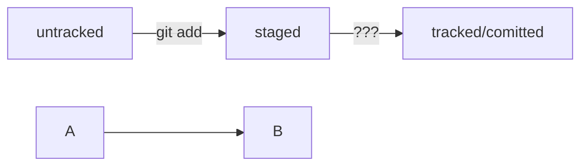

 # Порядок действий для создания, инициализации локального репозитория и связывание его с удаленным репозиторием на GitHub
 
 cd d:/'git projects'/'First Homework'  
    git init  
    touch readme.md  
    git add readme.md  
    git commit -m 'ddddd'  
    git status  
    git remote add git@github.com:Bolevor/first-homework.git  
    git push -u origin master

# Навигация по коммитам

## Хеш — идентификатор коммита	

Хеш — основной идентификатор коммита и позволяет узнать его автора, дату и содержимое закоммиченных файлов.

# HEAD — всему голова

Файл HEAD (англ. «голова», «головной») — один из служебных файлов папки .git. Он указывает на коммит, который сделан последним (то есть на самый новый).

# Логи

```
git log``` - команда вывода логов работы с git

```
git log --oneline``` - сокращенный лог

# Статусы файлов


